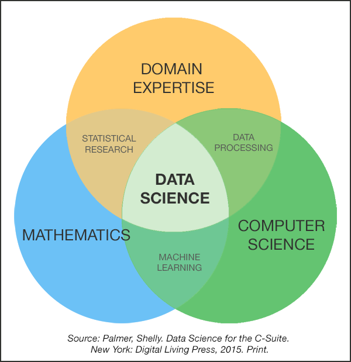

```{r datasci, include=TRUE, message = FALSE}
knitr::opts_chunk$set(echo = TRUE)
```

# PART I: Introduction {.unnumbered}

# what is "data science for the liberal arts?"

Hochster, in Hicks and Irizarry [-@hicks2018], describes two broad types of data scientists: Type A (Analysis) data scientists, whose skills are like those of an applied **statistician**, and Type B (Building) data scientists, whose skills lie in problem solving or coding, using the skills of the **computer scientist**.



But this view arguably omits a critical component of the field. The iconic [Venn diagram model of data science](https://www.google.com/search?q=venn+diagram+model+of+data+science&newwindow=1&safe=active&rlz=1C1CHBF_enUS762US763&tbm=isch&tbo=u&source=univ&sa=X&ved=0ahUKEwiM_abBtY7XAhXDQCYKHdgyB58QsAQIOg&biw=1378), as shown above, suggests that there are not two but three focal areas in the field, one of which begins not with math or computer science, but with "domain expertise."

#### some meanings of 'type C data science'

So, if Type A data science is characterized by mathematical and statistical sophistication, and Type B is associated with coding and computer science, what might the Type C data scientist, with their 'domain expertise', bring to the table?

An obvious starting point, at least for our purposes, is that 'Type C' data science begins with expertise in a particular *concentration* in the arts, humanities, social and/or natural sciences. That's domain expertise.

Data science also requires **communication**, **collaboration**, and **citizenship**.

Communication, including writing and the design and display of quantitative data, is central to data science because results are inconsequential unless they are recognized, understood, and built upon. Facets of communication include oral presentations, written texts and good data visualizations.

Collaboration is important because problems in data science are sufficiently complex so that any single individual will typically have expertise in some, but not all, facets of the area. Collaboration, even more than statistical and technical sophistication, is arguably the most distinctive feature of contemporary scholarship in the natural and social sciences as well as in the private sector [@isaacson2014].

Citizenship is important because we are humans living in a social world; it includes serving the public good, overcoming the digital divide, furthering social justice, increasing public health, diminishing human suffering, and making the world a more beautiful place. The Type C data scientist is aware of the fact that the world and workforce are undergoing massive change: This puts the classic liberal arts focus of "learning how to learn" (as opposed to memorization) at center stage. Finally, the Type C data scientist is sensitive to the creepiness of living increasingly in a measured, observed world. These real-world goals should be informed by ethical concerns including a respect for the privacy and autonomy of our fellow humans.

All of these 'C words' are, in a sense, subsumed by one other - **Conscientiousness**.

Type C data science is about conscientiousness in that the aim is not simply for work which is cool, efficient, or elegant, but also responsible and meaningful. Coding is a means to an end. Programming and statistics are tools in the service of creating a better world, of addressing social, environmental, and scientific concerns.

At the risk of oversimplifying:

- Type **A** data scientists focus on **Analysis** and questions about 'how?'

- Type **B** data scientists focus on **Building** and questions of 'what?'

- Type **C** data scientists focus on **Conscientiousness** and questions of 'why?', 'who?', 'what for?', and 'at what (social) cost?'

## the incompleteness of the data science Venn diagram

Data visualizations are starting points which can provide insights, typically highlighting big truths or effects by obscuring other, presumably smaller ones. The Venn diagram model of data science is no exception: As with other graphs, figures, and maps, it allows us to see by showing only part of the picture. What does it omit? That is, beyond mathematics, computing, and domain expertise, how else should we think about data science?

### an additional dimension

Cutting across these various facets (statistics, computing, domain expertise, collaboration, communication, and citizenship), a second dimension can be articulated. No one of us can excel in all of these domains, rather, each of us we might aim towards a hierarchy of goals ranging from **literacy** (can comprehend) through **proficiency** (can communicate and contribute) to **fluency** (can practice) to **leadership** (can create new solutions or methods).

That is, we can think of **a *continuum* of mastery, including knowledge, skills, interests, and goals.** That continuum ranges from the data *consumer* through the data *citizens* and *critics* to the data science *contributor.* Each aspect or type of data science can be arranged in this hierarchy:

+---------------------------------+--------------------------------------------------------------------------------------------------+----------------------------------------------------------------------------------------+---------------------------------------------------------------------------------------------------------------------------+
| Level and role                  | Type A:\                                                                                         | Type B:\                                                                               | Type C: Conscientiousness                                                                                                 |
|                                 | Analysis                                                                                         | Building                                                                               |                                                                                                                           |
+:===============================:+:================================================================================================:+:======================================================================================:+:=========================================================================================================================:+
| 1.  **Literacy**\               | Interpret a regression table; understand statistical significance and uncertainty.               | Understand what code does; describe a data pipeline or machine learning workflow.      | Read a study critically; recognize ethical, historical, and social dimensions of a data problem.                          |
|     (consumer; can comprehend)  |                                                                                                  |                                                                                        |                                                                                                                           |
+---------------------------------+--------------------------------------------------------------------------------------------------+----------------------------------------------------------------------------------------+---------------------------------------------------------------------------------------------------------------------------+
| 2.  **Proficiency**\            | Conduct an exploratory data analysis; create visualizations; apply standard statistical methods. | Modify scripts; clean and manage datasets; contribute code to a collaborative project. | Frame research questions; connect data to disciplinary knowledge; communicate findings to diverse audiences.              |
|     (citizen; can contribute)   |                                                                                                  |                                                                                        |                                                                                                                           |
+---------------------------------+--------------------------------------------------------------------------------------------------+----------------------------------------------------------------------------------------+---------------------------------------------------------------------------------------------------------------------------+
| 3.  **Fluency**\                | Design and execute a complete empirical study; build predictive models; evaluate evidence.       | Build reproducible software, databases, dashboards, or machine-learning applications.  | Lead domain-based investigations; integrate technical results with substantive interpretation and ethical reasoning.      |
|     (critic; can practice)      |                                                                                                  |                                                                                        |                                                                                                                           |
+---------------------------------+--------------------------------------------------------------------------------------------------+----------------------------------------------------------------------------------------+---------------------------------------------------------------------------------------------------------------------------+
| 4.  **Leadership**\             | Develop new analytical methods; establish research agendas; mentor analysts.                     | Create novel tools, platforms, or computational approaches; lead technical teams.      | Shape public discourse; influence policy and practice; advance scholarship, civic engagement, and responsible innovation. |
|     (contributor; can innovate) |                                                                                                  |                                                                                        |                                                                                                                           |
+---------------------------------+--------------------------------------------------------------------------------------------------+----------------------------------------------------------------------------------------+---------------------------------------------------------------------------------------------------------------------------+

*Table: Data science as an array of levels of mastery and aspects.*

## the importance of data science for society

The 'C' words of communication, collaboration, citizenship, and conscientiousness are all associated with the concept of trust. Trust is an important social good because it is associated with both individual well being [@poulin2015] and the stability of democratic institutions [@sullivan1999]. But interpersonal and institutional trust, including trust in science, have declined in recent years [@deane2024].

The decline in trust in science has been exacerbated by the so-called reproducibility (or replication) crisis, in which many scientific results initially characterized as "statistically significant" have been found not to hold up under scrutiny, that is, aren't reproducible. The reasons for the reproducibility crisis are many and contentious, but there is substantial consensus that one path towards better science involves the public sharing of methods and data. A second path towards better and more trustworthy science involves the use of larger datasets: With large datasets, effects are more stable and "statistical significance" is rarely a concern. Other indices, such as measures of accuracy and effect size are typically of primary interest. Data science, with its tools for reproducible analysis and its use of big data sets, can make science more trustworthy and improve the quality of our lives.

### the challenge of TMI

The challenges of data science are many, but perhaps the most fundamental is the problem of (literally) TMI. When we compare traditional statistics with modern data science, we realize that the former is typically concerned with making inferences from datasets that are too *small*, while the latter is concerned with making sense of data that is or are too *big* [@donoho2017]. The basic challenge of working in data science is the challenge of "too much information," or TMI.

The challenge of TMI is not new, or restricted to data science. In the 19th Century, Wilhelm Wundt argued that attention was the distinguishing act of the human mind [@blumenthal1975]. That is, in attending to (or focusing on) something, we must overlook everything else, consequently, *selection* is the essence of human perception [@erdelyi1974]. Selection is important not just in psychology, but in the arts as well, for *editing,* or choosing what not to write or show, is at the core of the creation of works including novels and film [@ondaatje2002].

Although the problem of TMI is not new, today it exists at a much greater scale, for there is simply more information around us. Indeed, over the last 20 years, the amount of digital information in the world has increased roughly 200-fold.[^01-datasci-1]

[^01-datasci-1]: According to Wikipedia, the Zettabyte (ZB) Era began in 2012, when the amount of digital information in the world first exceeded 1 ZB (or 10^21^ bytes). In 2025, it is estimated that the world will house 175 ZBs of digital data [@reinsel2025], hence a 175X increase in in 13 years. My estimate of a 200X increase in 20 years is a conservative extrapolation from these numbers. Incidentally, one ZB = 1,000,000,000,000,000,000,000 bytes, which could be stored on roughly 250 billion DVDs, or 500 million 2 TB hard drives.

Like perception in psychology and editing in the arts, data science is concerned with extracting meaning from information. Because the amount of information around us has mushroomed and its nature has become more important, our need to extract meaning has become more ubiquitous and more urgent. For these reasons, data science is a foundational discipline in 21st century inquiry.

## exercise

**1.1** Consider the 4 (row) x 3 (column) matrix above that describes levels and aspects of data science. In two paragraphs, describe your standing on each of the three aspects. Where are you now? Where would you like to be at the end of the class? Where would you like to be in a few years? Where can you make your greatest contribution to data science in the liberal arts?
