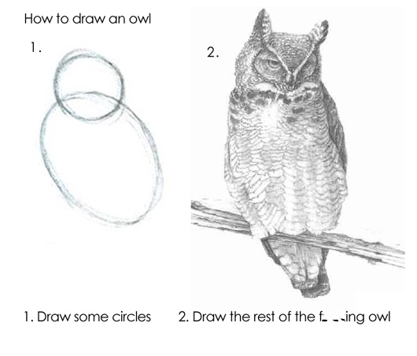

```{r setupowl, include=FALSE, message = FALSE}
knitr::opts_chunk$set(echo = TRUE)
```

# Part II: Towards data literacy {.unnumbered}

# now draw the rest of the owl



In the prior chapter, you explored several different sources for learning how to code in R. Now it's time for some hands-on experience.

## installing and loading packages (libraries)

Before we begin playing with data, a quick reminder that we will typically want to use R packages. We do this in two steps. The first of these is to install the packages on our physical computer. To install the tidyverse (which is actually a set of packages), we use the install.packages command in the chunk below. (You'll need to remove the octothorpe or pound sign (\#).

Then, to use the package, we need to load it, with the library command.

```{r}
# install.packages("tidyverse")
library(tidyverse)
```

## some datasets

Please **spend at least 180 mins exploring at least two of the following.** Be prepared to discuss your progress next class: You will be asked which source(s) you used, what you struggled with, what questions you have, and what you would recommend to your classmates. **Hint:** If you find the material too challenging, remember the 15 minute rule, take a break away from your machine and other screens, clear your head, then try a different approach.

### what's in a name?

When you learn that someone's name is, say, *Denise,* *Tracy, Donald*, or even *Adolf*, what goes through your head? Many new parents spend a great deal of time choosing a name for their child. Some of us have renamed ourselves - maybe we've embraced a nickname, are chasing celebrity with a stage name, or perhaps we've enrolled in a witness protection program (!).

The SSA (social security administration) has data on the historical popularity of first names in the US. The babynames package in R includes this dataset as well as others - you can read more about it on [this page](https://cran.r-project.org/web/packages/babynames/index.html "https://cran.r-project.org/web/packages/babynames/index.html"). Install and load the library. Learn something interesting from the data. Be prepared to share your struggles and insights with the class.

```{r}
#install.packages("babynames") # install package onto your machine 
library(babynames) # load the package into your R session 
head(babynames) # see what it looks like}
```

## find the movies

About ten years ago, Iain Carmichael used data from the Internet Movies Database (IMDB) to introduce R. You can see his introduction [here](https://idc9.github.io/stor390/notes/getting_started/getting_started.html).

There is a *lot* on that page. You can consider his report from the standpoint of style (formatting, organization), coding (how he did this), data (the part of the IMDB data he is looking at), and his results (plots of distributions and relationships).

If you try to open the dataset, however, you will run into an obstacle - the link on Carmichael's page is dead. Don't let that stop you. *(If you were working on your thesis and came across a problem like this, what would you do next?)* Once again, be prepared to share your struggles and insights with the class.

## play ball

Baseball, perhaps more than other major team sports, is a stat-intensive enterprise. "Sabermetrics" is area of study which (perhaps sadly) has nothing to do with swordfights, but instead takes its name from the Society of American Baseball Researchers (SABR).

Ben Baumer et al's (2024) [*Modern Data Science with R*](https://mdsr-book.github.io/mdsr3e/) is a useful supplementary text that covers much of the same territory as the present one. There is a supplemental R package (mdsr) that includes a number of small and interesting datasets, including one about major league baseball (MLB) teams and revenue

```{r}
# install.packages("mdsr")
library (mdsr)  
data(package = "mdsr") # list the datasets in the library 
head(MLB_teams)
```

There is a lot of baseball data that can be studied in R. If you are a fan, Albert et al's (2025) [*Analyzing Baseball Data with R*](https://beanumber.github.io/abdwr3e/)is a good way to learn R and learn about some of the statistical issues in the game.

Even if you aren't a fan, the way that we approach questions such as "[who is the GOAT in baseball?](https://www.nytimes.com/2025/08/12/science/baseball-statistics-babe-bonds.html?unlocked_article_code=1.zlA.o6Au.Ge6SzFhFQd4F&smid=url-share)" are worthy of consideration. How do you compare a player such as Babe Ruth - who played at a time when only white, American males could play - with Barry Bonds, or Shohei Ohtani? One answer is [here](https://eckeraadjustment.web.illinois.edu/era-adjusted-war.html).

## exercises

Be prepared to describe your progress with one or more of the datasets described above.

1.  Open the dataset. Describe the data in a paragraph based on one or more R functions (such as str, glimpse, and slice).

    a.  What are the variables? What are the observations? What are the data types? What are the ranges of the variables? Are there missing values?

2.  After looking at the data, describe one or more questions of interest that you would like to ask about the data. (I do mean "of interest" - something that has meaning, that people would actually like to know).

    a.  Write each question in a separate paragraph. Use headings to structure your document.

3.  Describe, in words, how you have, or how you would, look at your question. Be as specific as possible, but don't worry about R syntax (e.g., I would pull out such-and-such variables, or such-and-such observations, and I would compare them with x, or I would like this with 'y'). Explain what you might find, and why (again) that would be interesting.

    a.  Now draw the rest of the owl - translate your words into code, and run the analysis.

4.  If appropriate, describe what a graph or visualization of the data might look like.

    a.  go for it if you can.

5.  Save your work as an R markdown document, and knit it to an html file.
