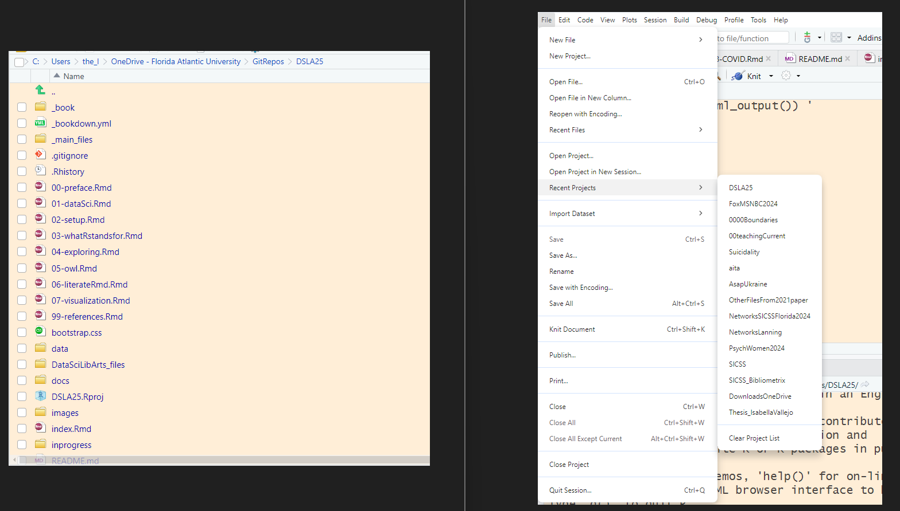

```{r literate, include=FALSE, message = FALSE}
knitr::opts_chunk$set(echo = TRUE)
```

# literate programming

Showing your work, to (future) you as well as to others, is a key part of reproducible science. R Markdown documents facilitate this, as they allow you to include comments, code, and results in a single place. But before we consider R markdown, we begin with two more elemental ideas: *projects* and *scripts* (R4DS, Chapter 6) .

## projects are directories

You should save your work in *projects.* These isolate your data and scripts into discrete directories.

There are two reasons I begin with 'projects:' The first is that students who are new to coding will often struggle to find their datasets and code on their personal machines; having a project directory makes things easier. The second is that , down the road, it's likely that you will be working on R for different things in parallel - for this and another class, for this class and your thesis, or perhaps for two distinct types of analysis within your thesis.



When you open up an R project, you'll be in the right directory, with the relevant files (and only the relevant files) at your fingertips in the files pane. It is yet another way in which the notion of 'tidiness' facilitates our work.

## scripts are files of code

To do simple exercises in R, you can enter code directly in the Console pane (the default is in the lower left of the RStudio screen), then get an instant response. This (interactive) approach to coding is quick, but it is difficult to recreate.

> For example, imagine that I were doing an analysis between age and a personality trait that, in one dataset, is referred to as 'Neuroticism' (N) and, in a second, the same trait is reverse scored as 'Emotional Stability' (ES). If I want to combine measures of N and ES from two different datasets, each of which has scores for the trait on a 1-7 (or 7-1) scale, I could reverse one of these. My code might look like this:

##### combine two small datasets, reverse one of them, print first and last few rows:

```{r }
library(tidyverse)
file1 <- read_csv("data/datawithN.csv")
glimpse (file1)
file2 <- read_csv("data/datawithES.csv")
glimpse (file2)
combinedfile <- file1 %>% 
    mutate(ES = 8 - N) %>% # Creates 'ES' from 'N' for file1
    select (-N) %>% 
    bind_rows(file2) 
combinedfile %>% 
    slice(c(1:3,18:20)) # the 'c' is for combine or concatenate
```

You'll want a record of your code for even simple transformations such as this one. R4DS Chapter 6 shows the R studio interface and encourages you to save your work in scripts. These are written in the source (editor) window in the upper left quadrant of the default R studio screen.

## R markdown / Quarto documents combine scripts with comments and (once knit) results

The objectives described in the prior section lead naturally to a consideration of R Markdown documents, which allow you to include comments, scripts, and results in a single place. In R4DS, Wickham [\@-wickham2023] describes the use of Quarto rather than R markdown. Regardless of whether you use Quarto (see Chapter 28 of R4DS, or the tutorial [here](https://quarto.org/docs/get-started/)) or R Markdown (see the tutorial [here](https://rmarkdown.rstudio.com/lesson-1.html)), I encourage you to use one of these powerful, organizing approaches for nearly everything you do in R.

There are as many as four parts of an R markdown or Quarto document:

-   A YAML (yet another markdown language) header or metadata
-   Text formatted in markdown
-   R code (chunks) surrounded by code fences
-   and, occasionally, inline code

## some elements of coding style

Good coding is often a combination of several skills ranging from puzzle-solving to communication. I can't claim that these are *the* elements of coding style (apologies to Strunk & White), but rather that these are merely some of the elements.

Good coding is **clear** and thus commented. You are writing for your future self as well as others, so be explicit about the purpose of each chunk of code.

Good coding is **concise**. When you can write code in 3 lines instead of 30, your code may be more clear and efficient. Take pleasure in writing parsimonious, efficient code. But where efficiency and clarity conflict, choose the latter.

Good code should be **complete**, including all steps from reading the data to producing output. Where appropriate, comment-out (rather than delete) informative errors, again for the future you.

Good code may be **creative**. The coolest solutions are those which pull from and synthesize a number of ideas. Creativity often requires walking away from a problem in order to ultimately arrive at a solution (Wertheimer's *Productive Thinking*).

Finally, good code should be **considered**. Reflect on the impacts of your work - just because you can analyze something doesn't mean that you should.

## What to do when you are stuck

-   Google. pay attention to your error messages

-   Ask for help, make your questions clear and reproducible (see R4DS Chapter 1)

-   Take a break, think outside the box and [kludge](https://www.google.com/search?newwindow=1&safe=active&rlz=1C1SQJL_enUS782US782&q=Dictionary#dobs=kludge) something together if you have to

-   Document your struggles and your cleverness for a future you
