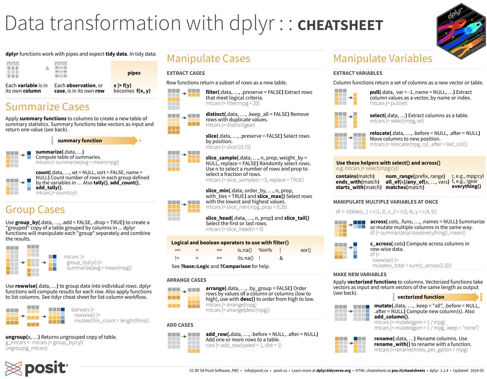

```{r wrangling, include=FALSE, message = FALSE}
knitr::opts_chunk$set(echo = TRUE)
```

# (PART) Part III Towards data proficiency {.unnumbered}

# wrangling and tidying


The term 'wrangling' has been used to describe the process by which unruly, messy, and complex datasets are organized and restructured so that they can be summarized, interpreted, and understood. *Wrangling* includes finding errors, which requires looking at your data closely enough to identify problems, and transforming the data as needed to allow data analyses to take place. *Tidying* is also concerned with data preparation, but is focused on the narrower task of arranging data into simple data frames (tibbles) in which each variable is in its own column, each observation is in its own row, and each cell includes one and only one value.

In practice, the processes of data wrangling and data tidying are often overlapping. In this chapter, we will explore (a little) wrangling and (some) tidying using simulated data. First, we briefly consider some characteristics of the tidyverse

## the structure of the tidyverse

The R programming language was initially intended to serve engineers, and the tidyverse can be seen as a collection of packages which are aimed at a broader audience of statisticians and data scientists, and to help them become more productive [@peng2018]. Tidyverse packages have a common syntax that makes it easier to generate and understand code and create reproducible results. Tidyverse packages may be described as having three layers.

**The core of the tidyverse** includes nine packages. You will see the list of these packages when you load the tidyverse:

```{r echo=TRUE}
library(tidyverse)
```

Each package includes a number of functions. Many tidyverse packages are described on handy [cheatsheets](https://posit.co/resources/cheatsheets/) such as this one for dplyr:

[](https://rstudio.github.io/cheatsheets/data-transformation.pdf)

**The periphery of the tidyverse** consists of additional packages which are less commonly invoked than those in the tidyverse core. Unlike the core packages, all of these peripheral or auxiliary packages must be loaded into memory by an explicit statement, e.g., *library(googlesheets4).* You can see the list of all (core and peripheral) packages with the tidyverse_packages command:

> *\> \# install.packages("tidyverse")\
> \> tidyverse_packages ()*

For me, the most useful packages in this peripheral or auxiliary layer have been **googledrive**, **googlesheets4**, and **readxl** (for working with Google apps and Excel files). I've also used **rvest**, **xml2**, and **jsonlite** (for web scraping and parsing more complex data structures).

In addition to the core and periphery of the tidyverse, there is a more loosely-defined third layer of what may be considered to be **tidyverse-friendly packages**. These packages, which are not installed with the core and peripheral tidyverse, include a wide range of tools that are handy for using tidy syntax in particular applications, such as **janitor** (for cleaning data), **tidytext** (for text analysis), and **tidygraph** (for network analysis). When you use these, you'll need to first make sure that they are installed on your machine. (R studio will remind you to do this). Then you can load them into memory.

At each of these three levels, the tidyverse is constantly evolving. For example, at this writing, one of the peripheral or auxiliary packages (**httr**) has been superseded by a newer package (**httr2**); despite this, httr (and not httr2) remains in the auxiliary layer.

## where should we eat?

Tidyverse functions from at least two of the core tidyverse packages, **dplyr** and **tidyr**, help wrangle, clean, and shape our data into a tidy form that can 'spark joy' [@kondo2016]. To learn more about tidy data and how we use dplyr and tidyr in everyday coding, we will construct and explore a simulated dataset, consisting of a 100 restaurants, each of which is described by just a few variables.

To do this, we'll first name the restaurants. We begin with the data from the babynames package, then will use *filter* function (from dplyr) to choose only names since 1981, then we *group* and *summarize* the data by name, then *arrange* (sort) the names by popularity, then *slice* (take only) the first 100 observations, then finally *select* only the name column. Each of these functions is part of the dplyr package:

```{r}
library(babynames)
# make restaurant names
restodata <- babynames |> 
    filter(year > 1980) |> 
    group_by(name) |> 
    summarise(n=sum(n)) |> 
    arrange(desc(n)) |> 
    slice(1:100) |> 
    select(name) 
head(restodata,3)
```

In the prior chunk of text we wrangled - or, if you prefer, massaged - the babynames data in a few ways to get us a simple list of 100 popular names. But this is only a start. Let's change the set of 'person names' into 'restaurant names.' To do this, we will use *mutate* (another dplyr function) then combine each name with the phrase *'s_place.*' To combine strings, we use the *str_c* function. This is from the **stringr** package, which is another package in the core of the tidyverse:

```{r}
restodata <- restodata |> 
    mutate (resto_name = str_c(name,"s_place")) 
head(restodata,3)
```

Now, assume that the restaurants has been graded by the Department of Health on an A to F scale. We'll assign these *health* ratings randomly, using the following three steps.

> *First, we seed the (pseudo) random number generator; this allows the result to be reproducible. If you don't do this, you will almost certainly get different ratings each time you run the code.*
>
> *Then, we declare health as a random integer for each restaurant on 1 to 5 scale. We can do this in several ways. Here, I use the sample function to directly generate my 100 integers. (I originally used runif, which generates random numbers, then rounded this score to the nearest integer, but this is more complicated, and leads to fewer observations with extreme values. It's commented out in my code.).*
>
> *Then, we recode these as letter grades using the case_when function. This function is akin to an 'if-else' statement. Note that the case_when syntax is tricky. If we think of the double equals as 'is equal to', the tilde as 'call it', and the comma as 'else,' the first part of the case when statement becomes the following:*
>
> *when health is equal to 1, call it F, else ...*

In addition to health, assume that we have cost data as well. We'll use essentially the same code to come up with our cost variable. Then we drop our original name variable.

```{r}
# add health ratings
set.seed(33458)
restodata <- restodata |>
#    mutate(health = round(runif(n=n(),1,5))) |> 
    mutate (health = sample(1:5, 100, replace=T)) |>  
    mutate(health = case_when(health == 1 ~ 'F',
                                health == 2 ~ 'D',
                                health == 3 ~ 'C',
                                health == 4 ~ 'B',
                                health == 5 ~ 'A')) |> 
    mutate(cost = sample(1:3, 100, replace=T)) |>
    mutate(cost = case_when(cost == 1 ~ '$',
                              cost == 2 ~ '$$',
                              cost == 3 ~ '$$$')) |> 
    select(-name)
head(restodata,3)
```

Each restaurant now has a restaurant name, a health rating, and a classification as cheap (\$), moderate (\$\$), or expensive (\$\$\$). Now we add an additional variable - *popularity*. This is again randomly generated on a 1 to 5 scale. But restaurants that are popular at lunch may not be popular at breakfast or dinner (they may cater to office workers, for example), and some restaurants may be closed for one or more of these meals - say, 30% at breakfast, 25% at lunch and 15% at dinner. Here, there are four separate steps:

> *Create 'breakfastdata' as a copy of the fakerestodata*
>
> *Generate a popularity score as a random variable.*
>
> *Generate a second random variable called 'meal', which is initially set to a random integer between 1 and 100.*
>
> *Then, use the case_when syntax to recode this: if mean is below a cutoff (30 for Breakfast), set the value to NA (missing), otherwise call it 'Breakfast.'*
>
> *Then do the same for 'lunchdata' and for 'dinnerdata.' We'll use different cutoffs here as we expect that more restaurants will be open for dinner, and fewer for breakfast.*
>
> *Then bind the lunchdata and the dinnerdata to the breakfastdata.*
>
> *Finally, remove the lines where the meal data is missing.*

We are calling this dataset 'tallrestodata' for reasons that will become apparent.

```{r}
# note that the same code runs three times 
# we should simplify this by creating a function
breakfastdata <- restodata |>
    mutate (popularity = sample(1:5, 100, replace=T)) |> 
    mutate (meal = sample(1:100, 100, replace=F)) |> 
    mutate (meal = case_when (meal < 31 ~ NA, 
                              TRUE ~ "Breakfast" ))
lunchdata <- restodata |>
    mutate (popularity = sample(1:5, 100, replace=T)) |> 
    mutate (meal = sample(1:100, 100, replace=F)) |> 
    mutate (meal = case_when (meal < 26 ~ NA, 
                              TRUE ~ "Lunch" ))
dinnerdata <- restodata |>
    mutate (popularity = sample(1:5, 100, replace=T)) |> 
    mutate (meal = sample(1:100, 100, replace=F)) |> 
    mutate (meal = case_when (meal < 16 ~ NA, 
                              TRUE ~ "Dinner" ))
tallrestodata <- lunchdata |> 
    bind_rows(dinnerdata, breakfastdata) |> 
    drop_na(meal)
head(tallrestodata,3)
```

### tall and wide formats

*Tallrestodata* is tidy - each column is a variable, each row is an observation, and each cell includes a unique value. But it may not be exactly what we need. I might, for example, want to go to a popular restaurant when no one else is there - perhaps to go to breakfast at a restaurant that is popular only at lunch and dinner.

One approach to this is to create a new variable in the data for the (average popularity at lunch and dinner) minus (popularity at breakfast). High scores on this would give us restaurants that might be really good or interesting, but not crowded, for a breakfast meal. But popularity at breakfast, lunch, and dinner are in different rows of the restodata; so this is a little tricky.

The easiest way to do this is to use the *pivot_wider* function from the tidyr package. Again, the syntax is challenging - you may find the [cheatsheet](https://rstudio.github.io/cheatsheets/tidyr.pdf) to be useful. This will reshape the data from tall and narrow to a format that is typically wider and shorter.

From this wider data, we use mutate twice t ultimately create a new variable called *secretBreakfastPlace*.

```{r}
widerestodata <- tallrestodata |> 
    pivot_wider(names_from = meal,
                names_prefix = "popularity_",
                values_from = 
                    c(popularity)) |> 
# we could create the secretBreakfast variable
# in a single step, but this is probably more clear
    mutate (lunchDinnerPop = (popularity_Lunch +
                popularity_Dinner)/2) |> 
    mutate (secretBreakfastPlace = lunchDinnerPop -
                popularity_Breakfast) 
head(widerestodata)
```

Although the *widerestodata* has what we want, it is not tidy: The 'popularity' variable is now in three columns rather than one, and there are many cells with missing values. So we reshape the data back to its tall and tidy form, but which now includes the variable describing the two new mutated variables. Then we sort it by our desired variable, secretBreakfastPlace

```{r}
tallrestodata <- widerestodata |> 
    pivot_longer(names_to = 'meal',
                names_prefix = "popularity_",
                 cols = c('popularity_Breakfast',
                          'popularity_Lunch',
                          'popularity_Dinner'),
                values_to = 
                    ('popularity'),
                values_drop_na = TRUE) |> 
    arrange(desc(secretBreakfastPlace))
head(tallrestodata)
```

### exercises

**Study and understand the code**. Ask and see if you can answer questions about each chunk of code. For example, there are 100 observations in each of the breakfast, lunch, and dinner datasets. How many are there in tall and wide restodata sets? Why?

**Expand on the code: Where you would *really* want to eat**? Look at the data and think about it. Make it more realistic if you can. How would you actually decide? Come up with a decision rule that you might use for choosing a restaurant. This rule might include filters and/or simple algebraic expressions (such as '+' or '-'). Express your decision rule using code, then select your best restaurant. You may also want to create new variables such as distance, ambiance, or type of cuisine.

## more on tidy coding

There are many sources for help. The help panel in R Studio is a start, but you may have better look on Google. Here are some suggestions:

1.  **work with tidy data.** Make each row an observation, and each column a variable. Complex data sets, such as samples of text, become much more manageable when reduced to simple arrays.

2.  **think in tidy; talk the talk**. For example, recognize that **%\>% or \|\>** (the pipe) means *then*. Statements with pipes begin with data, may include queries (extract, combine, arrange), and finish with a command.

3.  **search for tidyverse solutions.** When you have a problem in your code, for example, "how do I compute the mean for different groups of a variable in R?," do a Google search for *R mean groups tidyverse*, not just *R mean groups.* This will get you in the habit of working with tidy solutions where they can be found.

4.  **look for new answers**. Because R and the tidyverse are constantly evolving, consider looking at recent pages first. In your Google search bar, click on Tools -\> Past year).

5.  **adhere to good coding style.** Well-written code is reasonably parsimonious, readable, and easily debugged. There are a few style manuals for R, including one from [Hadley](http://adv-r.had.co.nz/Style.html), and this [Rchaeological Commentary] (<https://cran.r-project.org/web/packages/rockchalk/vignettes/Rstyle.pdf>).

6.  **write functions.** If you repeat a section of code, rewrite it as a function. (See the example above).

7.  **annotate your work**. Assume that you will come back to it at a later date, while working on a different project, and use portions of your current code. Your R markdown documents should be a log. When you run in to a significant, challenging problem, don't delete your mistakes, but \## comment them out - as I have done in a few places above.

```{r echo=TRUE, results="hide", message=FALSE}
library(gapminder)
b <- gapminder %>% 
# when should you comment out an error
# instead of deleting it? for me, I'll 
# comment out errors that took me a long time 
# to solve, and/or that I'll learn from. 
# Probably not here, in other words...
#  filter(lifeExp) > 70 bad parens
    filter(lifeExp > 70)
```

Finally, **maintain perspective.** Your need to solve problems (how to analyze x, etc.) should not take a back seat to your desire to write the best code. There is almost always a better way to do things. Strive reasonably to accomplish this, but be prepared to **kludge**.
