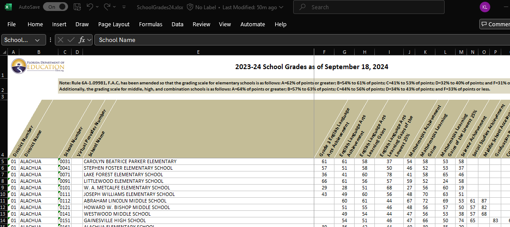

```{r data, message = FALSE}
knitr::opts_chunk$set(echo = TRUE)
# install.packages(c("corrr", "janitor"))
library(readxl)
library(janitor)
library(tidyverse)
library(corrr)
```

# finding, exploring, and cleaning data

**Data science, oddly enough, begins not with R... but with *data*.** There is no shortage of datasets available to analyze, and each can give rise to a host of interesting analyses and insights.

What do you want to study? Let's begin by looking at schools

## florida educational data

Florida, like many states, makes data on school quality publicly available. Schools are assessed, in part, on student performance (scores on comprehensive tests in fields such as English Language Arts). Schools are also assessed on measures such as whether this performance has increased across years, the percent of students who graduate in four years, and the percentage of students who pass Advanced Placement and related exams. You can learn more about these measures at <https://www.fldoe.org/core/fileparse.php/18534/urlt/SchoolGradesOverview24.pdf>).

The data itself are available in an Excel spreadsheet. Here's a screenshot of the first few columns and rows of the file.



It's apparent that the file looks a little messy. As we saw in a prior chapter, we would like the first row of the dataset to include the variable (column) names: here, there are three rows of header prior to this. Further, many of the variable names include spaces, minus signs, and the like.

We will first download the data from the web (at this writing, you can find it at <https://www.fldoe.org/file/18534/SchoolGrades24.xlsx>). We will store it on our disk in a subdirectory of our project folder called 'data.'


### A digression: Slash, Windows and the world.

Once we download the data, we need to tell R where to find it. If we are working with an *Rproject*, we might keep everything - code, data, and output - in the same directory. But we often need or want to store data in a separate place, in which case you will need to specify a file path, which will include one or more slashes (and not the Guns N' Roses guitarist kind).

In most of the computing world, including Macs, filepaths are delineated by forward slashes ("/"). On a Windows machine, they instead include backwards slashes ("\\"). To further complicate matters, the backwards slash has a special significance as an 'escape' character - this means, as we will see in the chapter on text analysis, that it tells the system to interpret the following character literally (for example, a comma is read as a *comma*) rather than symbolically (where a comma might be read as a separator between two objects).

In any operating system, we can locate files using relative paths (starting in your project directory) or absolute ones (starting in your computer's root directory). Relative paths generally work better, as you can use the code on multiple machines. But if you can't find your datafile, try the absolute path as a kludge.

### Getting the data from our machine into R

Ones we have specified the datapath, we can use the read_excel command, which is in the readxl library, which is part of the peripheral tidyverse (so you do not need to first install it on your computer). We'll tell R to skip the first three lines of text.

We'll continue the pipe with a simple command from the janitor package - which you will need to load on to your machine. That command gets rid of spaces in variable names and replaces them with *camelCase* or, the default, **snake_case**. (To see why you want to do this try omitting this line from your code).

```{r}
# relative path with backward slashes replaced by forward ones
datadir <- "data/" # this is a relative path
# absolute path with backward slashes made literal with escapes
# datadir <- "C:\\Users\\me\\OneDrive\\GitRepos\\DSLA25\\data\\"

FloridaSchools <- read_excel(
# here, we could also just do 
#   "data/SchoolGrades24.xlsx"), 
    paste0(datadir, "SchoolGrades24.xlsx"),
    skip = 3) |>
    clean_names() 
```

### which ones are "high schools"?

There are a few ways that we could reduce this to just High Schools - one is to include only schools which report a graduation rate that is not a missing value; the other is to include just schools that have "HIGH SCHOOL" in the title. **Which should we do? How should we decide?**

In either case, we then reduce the columns to a handful of measures of interest.

```{r}
FloridaHighSchools <- FloridaSchools |> 
#   drop_na('graduation_rate_2022_23') |> 
    filter(str_detect(school_name,
                      "HIGH SCHOOL")) |> 
    select (district_number, district_name, 
            school_number, school_name,
            english_language_arts_achievement,
            mathematics_achievement,
            science_achievement,
            social_studies_achievement,
            graduation_rate_2022_23,
            grade_2024,
            percent_of_economically_disadvantaged_students)
head(FloridaHighSchools)

```

### can we compute district (county) means?

Here, we reduce the set of high schools to one line per district, with scores the simple means of the schools in the district.

```{r}
FloridaHighSchoolsbyDistict <- FloridaHighSchools |> 
 #   select(-grade, -school_name) |> 
    group_by(district_name) |> 
    summarise_if(is.numeric, mean)
```

### can we estimate the relationship between economic disadvantage and graduation rates?

The answer is yes, but with a caveat. What is it?

**Hint: Which districts score at the top and bottom of these two indices? On the basis of our previous discussions in the class, what would we expect them to have in common?**

```{r}
FloridaHighSchoolsbyDistict |> 
    select(graduation_rate_2022_23,
           percent_of_economically_disadvantaged_students) |> 
    correlate()
```

### estimating school enrollments

I can't find data on HS enrollments that is free, recent, easy to pull down, and reasonably comprehensive. For our purposes, we can work with an estimate of this. There are measures of school size in Football league data (<https://fhsaa.com/news/2023/12/21/football-classifications-available-for-2024-25-2025-26.aspx>).

The names for schools there are formatted differently from our other dataset, so this will take a little work. We will first read in the data, then estimate enrollments based on the class of the school (Rural, 1R, 1A, 2A, 3A, 4A, 5A, 6A, 7A).

Can you describe what is happening in each line of code in this section?

```{r}
EnrollmentsFromFHSAA <- read_excel(
    paste0(datadir, "Football_2024_26.xlsx"),
        skip = 1) |>
    clean_names()
head(EnrollmentsFromFHSAA)

EnrollmentsFromFHSAA <- EnrollmentsFromFHSAA |> 
    separate(col =  "school_name",
             into =  c("school_name", "school_place"), 
             sep = "\\(", extra = "merge") |> 
    mutate (est_enrollment =
            case_when(
                class == "Rural" ~ mean(111,558),
                class == "1R" ~ mean(111,558),
                class == "1A" ~ mean(61,643),
                class == "2A" ~ mean(644,1166),
                class == "3A" ~ mean(1167,1542),
                class == "4A" ~ mean(1543,1822),
                class == "5A" ~ mean(1823,2135),
                class == "6A" ~ mean(2136,2512),
                class == "7A" ~ mean(2512,4627), 
                TRUE ~ NA)) |> 
        mutate(school_name = toupper(school_name))
```

Why do we get a warning here? Is it ok?

## can we merge the datasets?

The enrollment data are now in the EnrollmentsFromFHSAA dataset. We first edit the school names from the FloridaHighSchools file to see if we can get them to match. Then we try to merge these with the FloridaHighSchools data, using the school_name variable as the key.

```{r}

FloridaHighSchools <- FloridaHighSchools |>
    mutate(school_name = 
               str_replace(school_name,
                           "JUNIOR/SENIOR HIGH SCHOOL","")) |>
    mutate(school_name = 
               str_replace(school_name,
                           "MIDDLE/HIGH SCHOOL","")) |>
    mutate(school_name = 
               str_replace(school_name,
                           "SENIOR HIGH SCHOOL","")) |> 
    mutate(school_name = 
               str_replace(school_name,
                           "HIGH SCHOOL",""))
FloridaHighSchools2 <- FloridaHighSchools |>
    left_join(EnrollmentsFromFHSAA, by = "school_name")
```

## finding gremlins

But when we do this, we get another warning message. Why is it there?

In each of the two datasets, there are duplicate names. We can see this by looking at the output of the following commands:

```{r}
(SchoolsWithSameNamesInFHS <- FloridaHighSchools |> 
    group_by(school_name) |>
    filter(n() > 1) |> 
    select (school_name, district_name) |> 
    arrange(school_name))

(SchoolsWithSameNamesInEnrollments <- EnrollmentsFromFHSAA |> 
    group_by(school_name) |>
    filter(n() > 1) |> 
    select (school_name, school_place))
```

There are 12 schools (6 pairs) in our FloridaHighSchools data, and 26 schools (13 pairs) in the EnrollmentsFromFHSAA data. How might we fix these?

## can we merge the remaining data?

We will set these aside and merge the remaining data.

```{r}
(SchoolsWithUniqueNamesInFHS <- FloridaHighSchools |> 
    group_by(school_name) |>
    filter(n() == 1))

(SchoolsWithUniqueNamesInEnrollments <- EnrollmentsFromFHSAA |> 
    group_by(school_name) |>
    filter(n() == 1))

FloridaHighSchools2 <- SchoolsWithUniqueNamesInFHS |>
    left_join(SchoolsWithUniqueNamesInEnrollments, 
              by = "school_name")
```

### can we try to run the correlation again?

What does each line of this chunk do?

```{r}
GradCountsRates <- FloridaHighSchools2 |> 
    mutate(est_Ngrads = 
               round(est_enrollment * .01 *
               graduation_rate_2022_23),0) |>
    select(district_name, est_enrollment, est_Ngrads) |> 
    group_by(district_name) |> 
    summarise_if(is.numeric,sum, na.rm = TRUE) |> 
    mutate(adjGradRate = est_Ngrads / est_enrollment)
    
```

What's next?
```{r}
rdata <- FloridaHighSchools2 |> 
    select(district_name, graduation_rate_2022_23,
           percent_of_economically_disadvantaged_students) |>
    left_join(GradCountsRates, by = "district_name") |>
    select(graduation_rate_2022_23,
           adjGradRate,
           percent_of_economically_disadvantaged_students) |> 
    correlate()
```
